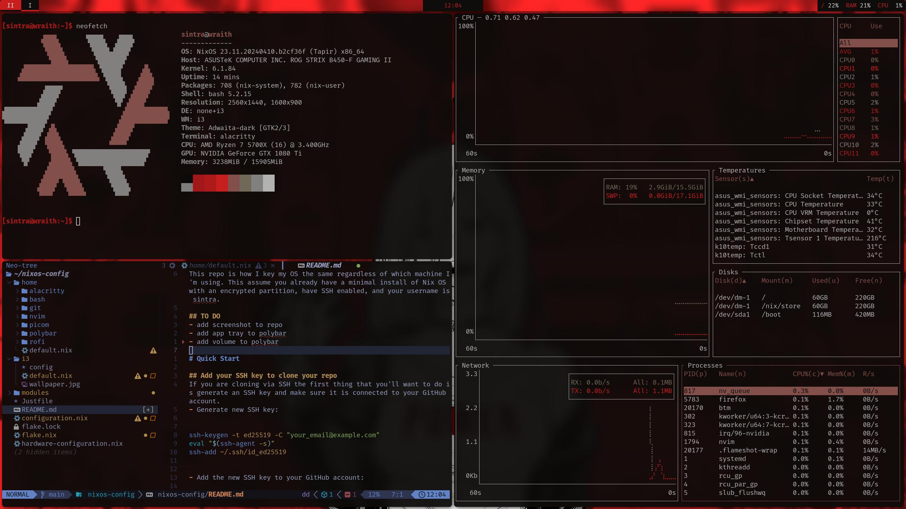

This repo is how I keep my OS the same regardless of which machine I'm using. This assume you already have a minimal install of Nix OS with an encrypted partition, have SSH enabled, and your username is sintra.


^ what it should look like ^

# Quick Start

## Add your SSH key to clone your repo
If you are cloning via SSH the first thing that you'll want to do is generate an SSH key and make sure it is connected to your GitHub account.
- Generate new SSH key:

```bash
ssh-keygen -t ed25519 -C "your_email@example.com"
eval "$(ssh-agent -s)"
ssh-add ~/.ssh/id_ed25519
```

- Add the new SSH key to your GitHub account:
```bash
cat ~/.ssh/id_ed25519.pub
# Then select and copy the contents of the id_ed25519.pub file
# displayed in the terminal to your clipboard
```
- In the upper-right corner of any page, click your profile photo, then click Settings.
- In the "Access" section of the sidebar, click SSH and GPG keys.
- Click New SSH key or Add SSH key.
- In the "Key" field, paste your public key.
- Click Add SSH key.
## Clone Nix OS repo to your home directory
```bash
# If you're using SSH
git clone git@github.com:VicentePSalcedo/nixos.git
# If you're using HTTPS
git clone https://github.com/VicentePSalcedo/nixos.git
```

## Link repo and rebuild
```bash
sudo mv /etc/nixos /etc/nixos.bak # Backup the original configuration
sudo ln -s ~/nixos/ /etc/nixos
mkdir ~/nixos/"your-hostname"
cp /etc/nixos.bak/configuration.nix /etc/nixos.bak/hardware-configuration.nix ~/nixos/"your-hostname"/
# need to git add because the flake is tied to the git version control and wont see new files otherwise
```
I recommend importing base.nix in your new configuration.nix
```bash
git add .
# Deploy the flake.nix located at the default location (/etc/nixos)
sudo nixos-rebuild switch
```

## Resources
[Quick Home Manager Look Ups](https://nix-community.github.io/home-manager/options.xhtml)
[Quick Configuration Options Look Ups](https://nixos.org/manual/nixos/stable/options)
